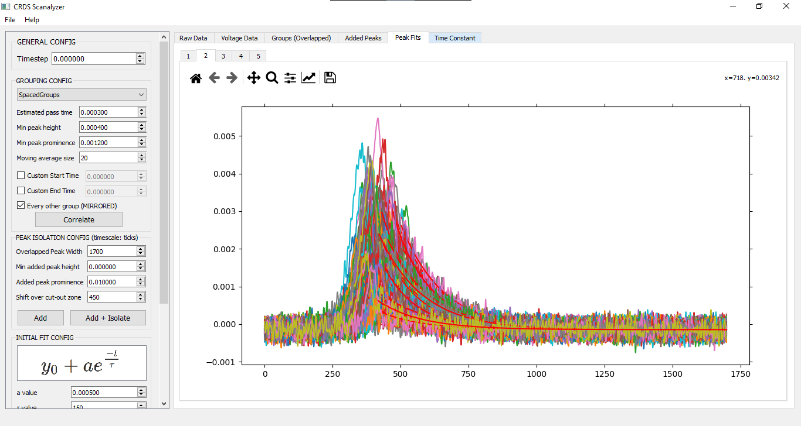
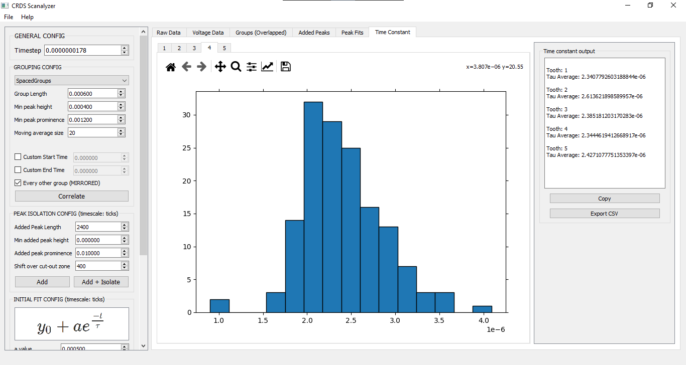
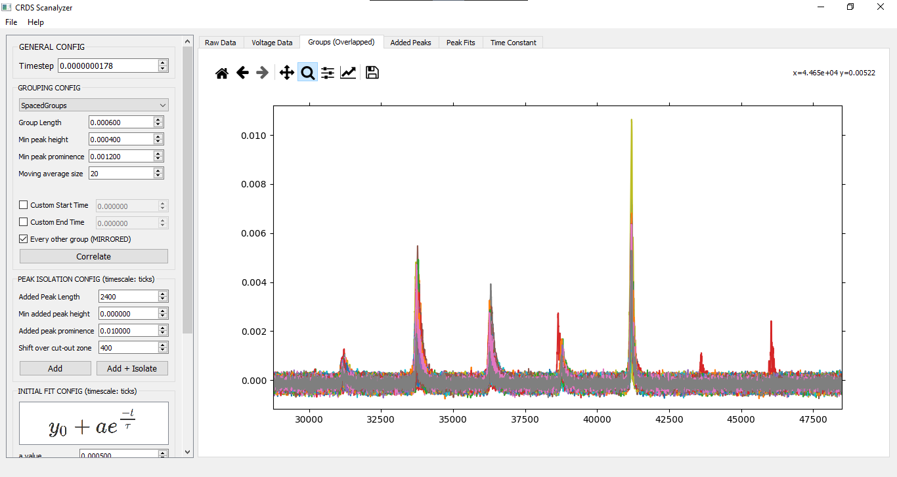

# CRDS Scan Analyzer

## Basics

- Designed for usage with **Mid-IR laser comb** scan output (time scale, not frequency)

- Expected data column format: `<time>, <signal voltage in>, <piezo crystal voltage out (optional)>`

## Building (Python 3.8+)

1. `pip3 <or python3 -m pip> install -r requirements.txt`

2. `build.cmd -compileUI -build`

3. Find build output in `/dist/`

## General Usage

1. Import data (CSV - default Zurich output format)
   
   - Comment - %
   - Delimiter - ;

2. Cut out & overlay peak groups using either piezo-voltage-threshold or group-spacing algorithm 

3. Set peak isolation parameters + guesses for ringdown function coefficients 

4. Admire glorious tau distributions for each comb tooth - **Note that the timescale used during correlation, adding & fitting  (including the initial guess for tau) is in SENSOR TICKS. The resulting tau values are converted back to the original timescale at the end.**

## Instructions

##### GENERAL CONFIG

| Input    | Purpose                                                |
| -------- | ------------------------------------------------------ |
| Timestep | Time interval of each sensor tick (e.g. 0.0000000178s) |

##### GROUPING CONFIG (SpacedGroups)

The SpacedGroups algorithm uses the length of each group (looking *length* in each direction from the first peak in the group) to determine which peaks fit into which group.

| Input               | Purpose                                                                                                                                                           |
| ------------------- | ----------------------------------------------------------------------------------------------------------------------------------------------------------------- |
| Group length        | How long in time the peak group is (e.g. 0.0006s)                                                                                                                 |
| Min peak height     | The lowest acceptable height for a peak to be detected                                                                                                            |
| Min peak prominence | Prominence of detectable peaks - read about prominence [here](https://en.wikipedia.org/wiki/Topographic_prominence). Is finnicky, might have to play around a bit |
| Moving average size | Peak detection uses a moving average (of which this is the denominator) to smooth out the data **(FOR GROUPING ONLY)**.                                           |

**Notes**

- You can custom start and end cutoffs for grouping in case there's only part of a group at the beginning or end

- You can choose to exclude mirrored groups (which occur every other group). Or don't. Depends on how you configured the lab setup.

##### GROUPING CONFIG (VThreshold)

This algorithm *should* look at the min and max voltages provided to separate out groups. It's not implemented yet, though.

##### PEAK ISOLATION CONFIG

This is where the overlayed peak groups are added together, and the added peaks are cut out.

**Note that the timescale here is in ticks, NOT seconds/milliseconds/etc.**

| Input                   | Purpose                                                                                                             |
| ----------------------- | ------------------------------------------------------------------------------------------------------------------- |
| Added peak length       | The length of the (added) peaks that you want cut out. Centers around tip of peak.                                  |
| Min added peak height   | The lowest acceptable height for a peak to be detected                                                              |
| Added peak prominence   | Prominence of detectable peaks - read about prominence [here](https://en.wikipedia.org/wiki/Topographic_prominence) |
| Shift over cut-out zone | How many ticks to shift the center of the cut-out zone from the peak tip                                            |

##### INITIAL FIT CONFIG

`y = y0 + a*e^(-t/tau)`

| Input                | Purpose                                                 |
| -------------------- |:------------------------------------------------------- |
| *a* value            | Variable in equation                                    |
| *tau* value          | Variable in equation                                    |
| *y0* value           | Variable in equation                                    |
| Shift over fit start | How many ticks to shift over the start of the curve fit |

## Feature Set

| Feature                                        | Status |
| ---------------------------------------------- |:------:|
| Import CSV Data                                | ✅      |
| Group peaks (peak spacing)                     | ✅      |
| Group peaks (piezo crystal voltage thresholds) | ❌      |
| Custom start & end times for peak grouping     | ✅      |
| Correlate grouped peaks                        | ✅      |
| Add & cut out overlayed peaks                  | ✅      |
| Batch fit peaks                                | ✅      |
| Display average tau data                       | ✅      |
| Export data as CSV                             | ✅      |
| Residuals on fits                              | ✅      |
| Standard deviations                            | ✅      |
| Persistent data storage                        | ❌      |

## Ideas if anyone has the time to add anything

- Speedier iteration & number crunching ([Numba](https://numba.pydata.org/))

- Support for different file formats (e.g. [LabView]([npTDMS · PyPI](https://pypi.org/project/npTDMS/)))

## Screenshots

